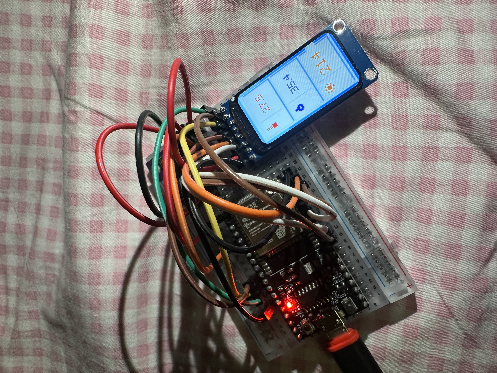
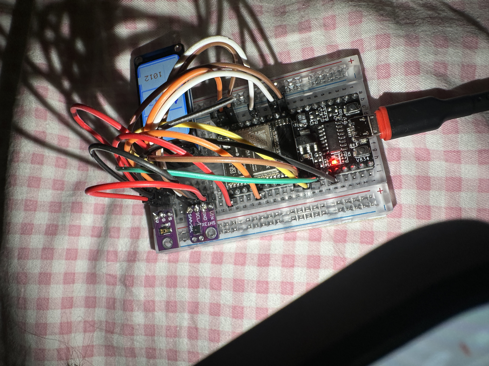

# ESP32 ST7789 Env Monitor

Minimal portrait environment dashboard for ESP32 with a `1.47"` `ST7789` TFT display, `SHT30` temperature/humidity sensor, and `TEMT6000` ambient light sensor.

## Photos

## Features

- Portrait UI for `172x320` `ST7789`
- Large minimal cards with icon-style indicators
- Temperature from `SHT30`
- Humidity from `SHT30`
- Approximate ambient light level from `TEMT6000`
- Lightweight Arduino sketch without heavy graphics libraries

## Hardware

- ESP32 dev board
- `1.47"` `172x320` SPI TFT on `ST7789`
- `SHT30` I2C sensor
- `TEMT6000` analog light sensor

## Wiring

### TFT ST7789

- `VCC` -> `3V3`
- `GND` -> `GND`
- `SCK` -> `GPIO18`
- `MOSI` -> `GPIO23`
- `CS` -> `GPIO5`
- `DC` -> `GPIO27`
- `RST` -> `GPIO26`
- `BL` -> `GPIO14`

### SHT30

- `VIN` -> `3V3`
- `GND` -> `GND`
- `SCL` -> `GPIO22`
- `SDA` -> `GPIO21`

### TEMT6000

- `VCC` -> `3V3`
- `GND` -> `GND`
- `S` -> `GPIO34`

## File

- `esp32_env_tft_emoji_fixed.ino` — final approved sketch currently used on the device

## Notes

- `TEMT6000` value is an approximate light level, not a calibrated lux meter.
- `SHT30` temperature and humidity readings are much closer to real values.
- The UI is optimized for this exact display orientation and pinout.

## Flashing

1. Open `esp32_env_tft_emoji_fixed.ino` in Arduino IDE.
2. Select `ESP32 Dev Module`.
3. Select the correct serial port.
4. Upload to the board.
